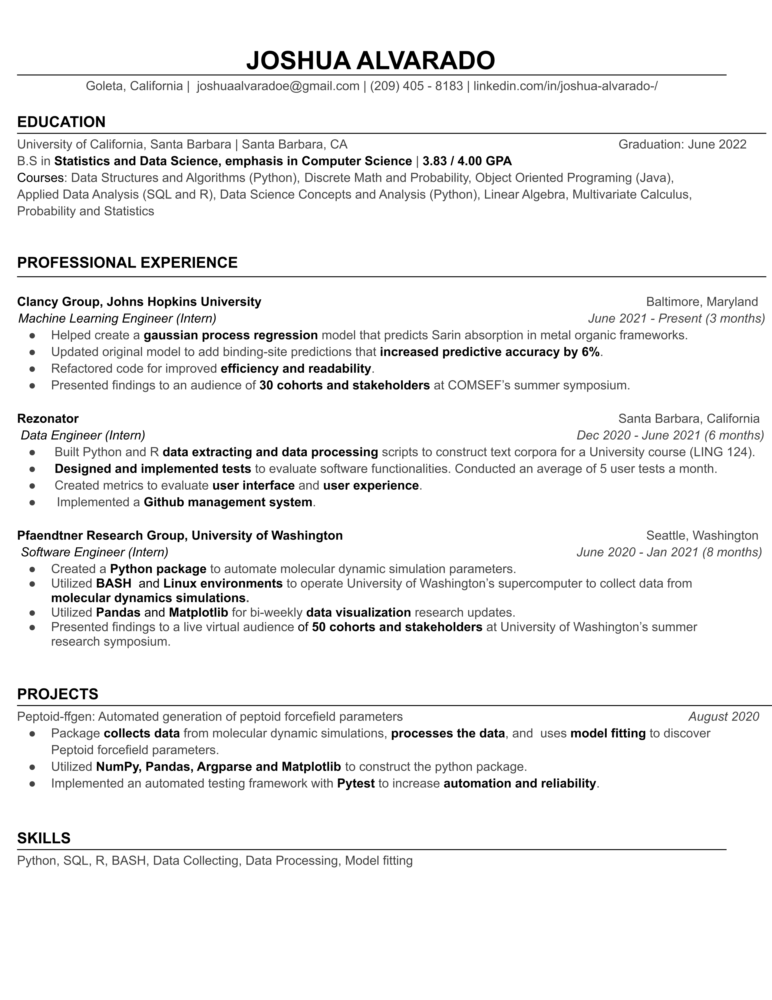
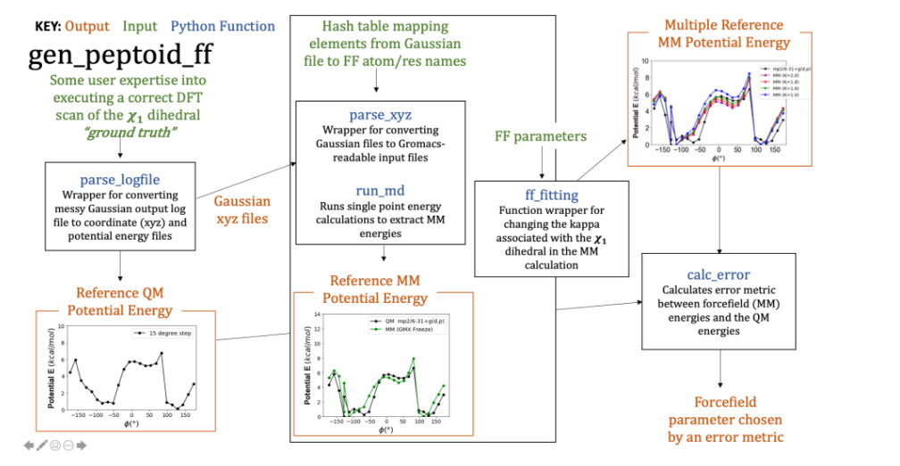
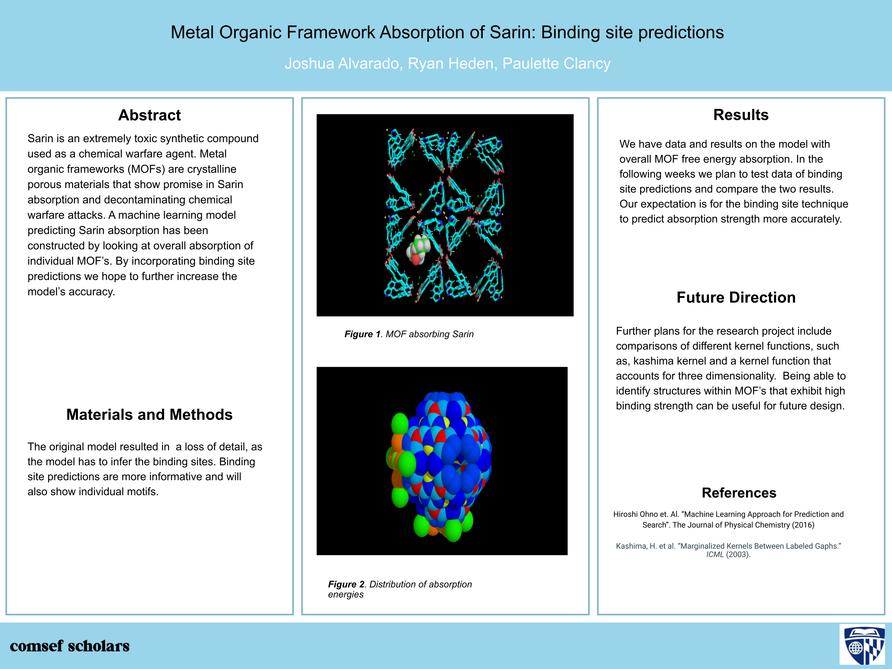

# Joshua Alvarado

- [About](#about)
- [Contact](#contact)
- [Resume](#resume)
- [Projects](#projects)

# About

Hello, I am Joshua Alvarado, a 4th year Statistics and Data Science major at UCSB. I am pursuing a career in software and data. This website is an assignment for my WRIT 107T course but  This is also my first time creating a website in markdown but I am interested in using this as a template for hosting my own personal website that I can show to recruiters.

# Contact 

Follow me on [LinkedIn](https://www.linkedin.com/in/joshua-alvarado-/)

# Resume 10/4/2021

# Projects

## Peptoid-ff Gen.

A python package for the automated generation of peptoid forcefield parameters. Created as part of the Jim Pfaendtner Research Group at University of Washington.

## Metal Organic Framework Absorption of Sarin: Binding site predictions

Sarin is an extremely toxic synthetic compound used as a chemical warfare agent. Metal organic frameworks (MOFs) are crystalline porous materials that show promise in Sarin absorption and decontaminating chemical warfare attacks. A machine learning model predicting Sarin absorption has been constructed by looking at overall absorption of individual MOF’s. Created as part of the Clancy Group at Johns Hopkins University.

## Relevant Coursework

- Technical Writing
- Data Structures and Algorithms
- Java Programming, Object Oriented Programming
- Data Science Capstone
- Data Science Principles (R, SQL)
- Statistical Data Science (Python)
- Probability and Statistics 
- Regression Analysis
- Discrete Math
- Linear Algebra with Applications
- Multivariable Calculus
- Differential Equations
